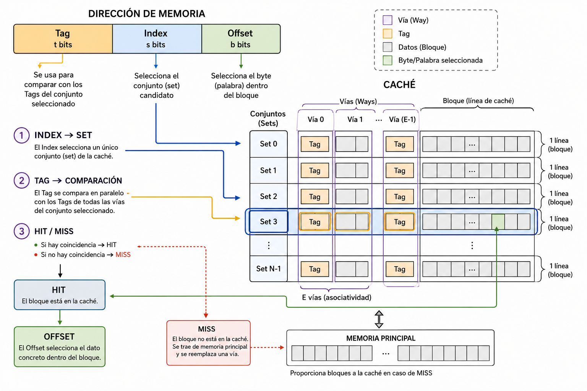
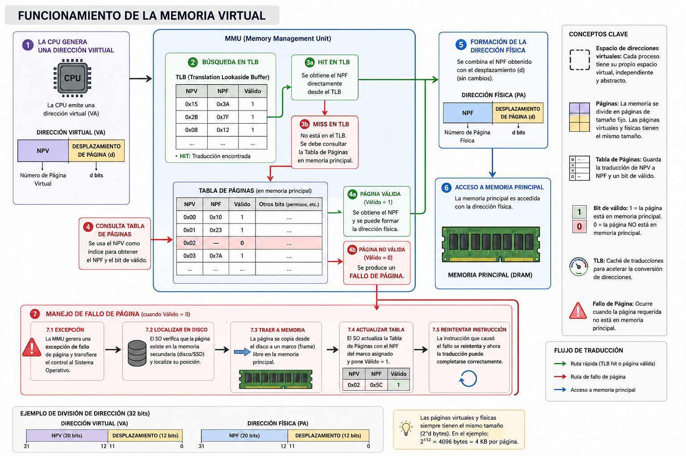

# Ejemplo de examen tipo test

## CUESTIÓN 4 (10 preguntas, 1.5 puntos)

Indique que opción es la correcta en el margen izquierdo de cada pregunta. Sólo se puede seleccionar una opción. Cada respuesta incorrecta resta un tercio de una correcta. ́

---

### 1. Una CPU tiene una cache con 32 líneas que divide las direcciones en los siguientes campos: DESPLAZAMIENTO de 8 bits, INDICE de 4 bits y ETIQUETA de 20 bits. Indique que afirmación es la correcta:

- A. La cache es asociativa por conjuntos de 8 vías.
- B. La cache es asociativa por conjuntos de 4 vías.
- **C. La cache es asociativa por conjuntos de 2 vías.**
- D. La cache es de mapeado directo.

**Explicación**

La opción correcta para esta pregunta de examen es la **C. La cache es asociativa por conjuntos de 2 vías**.

Vamos a desglosar los errores conceptuales y a realizar el cálculo correcto:

- 1 El cálculo correcto (Por qué es la C)
  Para resolver este tipo de problemas, hay que recordar la relación entre el tamaño del índice, el número de conjuntos y el total de líneas:

- **El índice determina los conjuntos:** El campo ÍNDICE de la dirección se utiliza para seleccionar el conjunto en el que se ubicará el bloque. Si el índice tiene **4 bits**, significa que la caché está dividida en $2^4 =$ **16 conjuntos**.
- **Cálculo de las vías:** El grado de asociatividad (las vías) es simplemente el número de líneas que hay dentro de cada conjunto. Si el enunciado dice que la caché tiene un total de **32 líneas**, dividimos:
  $$
  32 \text{ líneas en total} / 16 \text{ conjuntos} = 2 \text{ líneas por conjunto (2 vías)}
  $$

**Por lo tanto, la afirmación correcta es que la caché es asociativa por conjuntos de 2 vías.**

_Notas_:

- **Sobre la opción D (Mapeado directo):** Las cachés de mapeado directo (o correspondencia directa) **sí tienen índice**, y lo utilizan para identificar directamente la única línea en la que puede ubicarse un bloque.
- El único tipo de caché en el que **el índice no existe** (y la dirección se compone únicamente de Etiqueta y Desplazamiento) es en la **caché completamente asociativa**.

- _Comprobación extra:_ Si esta caché de 32 líneas fuera realmente de mapeado directo, tendría 32 conjuntos (1 vía por conjunto). Para direccionar 32 conjuntos necesitarías obligatoriamente un índice de 5 bits ($2^5 = 32$), lo cual choca con los 4 bits del enunciado.

- Las direcciones de memoria se dividen (de izquierda a derecha) en:
  - **Etiqueta**: Esto identifica el bloque (que se almacena en una vía) dentro del conjunto.
  - **Índice**: Esto direcciona el conjunto.
  - **Desplazamiento**: _bits menos significativos_. Esto direcciona el byte o palabra dentro del bloque.

- Relación entre los conceptos de bloque y vía:
  - Un bloque se almacena en una vía, pero:
    - El bloque es el contenido
    - La vía es el contenedor

### Esquema de direccionamiento en cache

---

### 2. Se tiene una cache de mapeado directo con la siguiente division de direcciones: DESPLAZAMIENTO de 8 bits, ́́INDICE de 4 bits y ETIQUETA de 20 bits. Indique el numero y el tipo de fallos que se producen para la siguiente secuencia de referencias a direcciones de memoria: 0xA101, 0xA104, 0xB102, 0xBC03, 0xA1FF. Suponga que la cache está inicialmente vacía.

- A. 4 fallos forzosos y 0 fallos por conflicto.
- B. 3 fallos forzosos y 0 fallos por conflicto.
- C. 3 fallos forzosos y 1 fallos por conflicto.
- D. 2 fallos forzosos y 1 fallo por conflicto.

#### Solución

Como tenemos 8 bits para el desplazamiento, el bloque es de 256 Bytes.

**1. Primera lectura: `0xA101`**

- **Desglose:** Etiqueta = `0xA`, Índice = `1`, Desplazamiento = `01`.
- **Estado:** El conjunto 1 está inicialmente vacío.
- **Resultado:** Como es la primera vez que se accede al bloque `0xA1` (que incluye desde la dirección `0xA100` hasta `0xA1FF`), se produce un **Fallo Forzoso**. El bloque se carga desde la memoria principal y se guarda en el conjunto 1.

**2. Segunda lectura: `0xA104`**

- **Desglose:** Etiqueta = `0xA`, Índice = `1`, Desplazamiento = `04`.
- **Estado:** La caché busca en el conjunto 1. Allí encuentra la etiqueta `0xA`, que coincide exactamente con la etiqueta de la dirección solicitada.
- **Resultado:** Como el bloque ya fue cargado en el paso anterior, se produce un **Acierto**.

**3. Tercera lectura: `0xB102`**

- **Desglose:** Etiqueta = `0xB`, Índice = `1`, Desplazamiento = `02`.
- **Estado:** Se busca en el conjunto 1, pero la etiqueta almacenada es `0xA`, la cual no coincide con la nueva etiqueta `0xB`.
- **Resultado:** Al ser la primera vez en toda la ejecución que se pide el bloque `0xB1`, se trata de otro **Fallo Forzoso**. El nuevo bloque se trae a caché y **sobrescribe** (expulsa) al bloque `0xA1` que ocupaba el conjunto 1.

**4. Cuarta lectura: `0xBC03`**

- **Desglose:** Etiqueta = `0xB`, Índice = `C` (12 en decimal), Desplazamiento = `03`.
- **Estado:** El conjunto C está vacío.
- **Resultado:** Es la primera vez que se referencia este bloque. Por tanto, se produce un **Fallo Forzoso**. El bloque se carga de forma limpia en el conjunto C sin expulsar a nadie.

**5. Quinta lectura: `0xA1FF`**

- **Desglose:** Etiqueta = `0xA`, Índice = `1`, Desplazamiento = `FF`.
- **Estado:** La caché busca en el conjunto 1 esperando encontrar la etiqueta `0xA`. Sin embargo, en el paso 3 ese conjunto fue sobrescrito con la etiqueta `0xB`.
- **Resultado:** El bloque `0xA1` ya había estado almacenado en la caché al principio, pero fue reemplazado a pesar de que había más espacio libre en otras líneas de la caché. Al volver a solicitar un bloque expulsado por colisión en su misma línea, se produce un **Fallo por Conflicto**.

#### **Resumen de la solución:**

Para esta secuencia exacta se producen:

- **3 Fallos Forzosos** (`0xA101`, `0xB102`, `0xBC03`)
- **1 Acierto** (`0xA104`)
- **1 Fallo por Conflicto** (`0xA1FF`)

#### Tipos de fallos (forzosos, capacidad y conflicto)

Según las fuentes proporcionadas, existe un modelo de clasificación llamado el **"Modelo de las tres C"** que clasifica los fallos de caché en tres tipos distintos:

1. **Fallos forzosos (Compulsory misses):** También conocidos como fallos de arranque en frío o de primera referencia. Se producen la primera vez que se accede a un bloque de memoria, ya que este no puede encontrarse en la caché por no haber sido referenciado nunca antes. Son inevitables en el primer acceso y solo dependen del tamaño del bloque.
2. **Fallos por capacidad (Capacity misses):** Ocurren cuando la caché entera no tiene el tamaño suficiente para contener todos los bloques necesarios durante la ejecución de un programa. Al llenarse la caché, los bloques son reemplazados por otros nuevos y, cuando los bloques antiguos vuelven a ser solicitados, se produce este fallo.
3. **Fallos por conflicto (Conflict misses):** También llamados fallos por colisión. Se producen cuando varios bloques referenciados tienen que ubicarse obligatoriamente en la misma línea o conjunto, y la cantidad de bloques supera el grado de asociatividad (las vías) disponibles para esa posición.

Un fallo por conflicto y un fallo por capacidad son conceptos completamente diferentes por la siguiente razón:

- Un **fallo por capacidad** implica que la caché **está totalmente llena** y literalmente no caben más bloques.
- Un **fallo por conflicto** provoca un reemplazo por falta de espacio en una línea o conjunto específico, **incluso aunque el resto de la caché permanezca vacía**.

**En resumen**, los fallos forzosos (primera vez), los fallos por capacidad (caché pequeña) y los fallos por conflicto (colisión en el mapeo) son tres fenómenos independientes entre sí.

### 3. Un sistema de memoria virtual tiene las siguientes características: direcciones virtuales de V bits, direcciones físicas de F bits, tamaño de página de 2p bytes y una TLB de mapeado directo con 2L líneas. Indique cuantos elementos tiene la tabla de paginas.

- A. 2F - P - L
- B. 2F - P
- C. 2V - P - L
- D. 2V - P

#### Solución

La opción correcta es la **D. $2^{V-P}$**.

Aquí tienes la explicación detallada paso a paso basándonos en la teoría de memoria virtual:

**1. Relación entre la Tabla de Páginas y el espacio virtual**
La Tabla de Páginas es una estructura de datos que reside en memoria principal y cuya función es almacenar las traducciones de las direcciones. Su característica fundamental para resolver este problema es que **tiene exactamente una entrada por cada página virtual** del espacio de direcciones del proceso. Por lo tanto, calcular el número de elementos de la tabla es lo mismo que calcular cuántas páginas virtuales totales hay.

**2. Cálculo matemático del número de páginas virtuales**
Para calcular el número total de páginas virtuales, necesitamos dividir el tamaño total del espacio virtual entre el tamaño de una sola página:

- El tamaño total del espacio virtual se deduce de la longitud de la dirección virtual ($V$ bits). Es decir, el espacio total es de **$2^V$ bytes**.
- El tamaño de cada página te lo da el enunciado: **$2^P$ bytes** (lo que significa que el desplazamiento de página ocupa $P$ bits).
- Dividiendo ambos obtenemos el Número de Página Virtual (NPV), que equivale a los elementos de la tabla: $\frac{2^V}{2^P} = 2^{V-P}$.

**3. Por qué el resto de datos son distractores (trampas)**
En este tipo de ejercicios es común que se incluyan datos que no necesitas para despistarte:

- **Direcciones físicas de $F$ bits:** Este dato sirve para averiguar la cantidad de páginas físicas en la memoria principal (que sería $2^{F-P}$), pero no afecta en absoluto a la longitud de la Tabla de Páginas, ya que esta se mapea cubriendo todo el espacio virtual, no el físico.
- **TLB de $2^L$ líneas:** La TLB (Translation Lookaside Buffer) es una pequeña memoria caché ultrarrápida situada dentro del procesador que solo almacena las traducciones más recientes. Su tamaño es totalmente independiente del tamaño que tenga la Tabla de Páginas completa.

#### Explicación conceptos teóricos

Un sistema de memoria virtual gestiona automáticamente los niveles de memoria principal y secundaria, y proporciona un esquema de protección y abstracción para los programas.

Los conceptos fundamentales involucrados en su funcionamiento son los siguientes:

- **Espacio de direcciones virtuales:** Cada proceso en ejecución tiene su propio espacio de direcciones independiente `. Este espacio no existe físicamente, sino que es una abstracción; es la forma en la que el proceso y el programador "ven" la memoria principal `.
- **Direcciones Virtuales:** Son las direcciones de memoria que genera o emite directamente la CPU `. Se dividen matemáticamente en dos campos: el **Número de Página Virtual (NPV)** y el **Desplazamiento de página** `.
- **Direcciones Físicas:** Son las direcciones reales que referencian o "atacan" físicamente a la memoria principal (DRAM) `. Se componen del **Número de Página Física (NPF)** y del **Desplazamiento de página** `.
- **Páginas:** En el contexto de la memoria virtual, a los bloques de memoria se les denomina "páginas" `. Es fundamental destacar que las páginas virtuales y las páginas físicas tienen siempre exactamente el mismo tamaño `.
- **MMU (Memory Management Unit):** Es el componente de hardware encargado de realizar la traducción de las direcciones virtuales emitidas por la CPU a sus correspondientes direcciones físicas en la memoria principal ``.
- **Tabla de Páginas:** Es una estructura de datos que almacena las traducciones de direcciones `. Se accede a ella utilizando el Número de Página Virtual (NPV) para obtener el correspondiente Número de Página Física (NPF) `. Cada entrada incluye un "bit de válido" que indica si la página se encuentra realmente en memoria principal o no `, `.
- **Fallo de Página:** Es una excepción que se produce cuando la CPU intenta acceder a una página virtual que no se encuentra actualmente en la memoria principal (es decir, su bit de válido es 0) `, `. Ante este fallo, el Sistema Operativo debe tomar el control, ir a buscar la página requerida a la memoria secundaria (disco o SSD) y transferirla o copiarla a la memoria principal `, `.
- **TLB (Translation Lookaside Buffer):** Es una pequeña memoria caché de alta velocidad (que se sitúa dentro del procesador) encargada de almacenar las traducciones más recientes de Número de Página Virtual a Número de Página Física `, `. Se accede a ella exclusivamente con el NPV para agilizar el proceso de traducción y evitar la penalización de tener que consultar la Tabla de Páginas en memoria principal `, `.

#### Tipos de TLB: de mapeo directo, totalmente asociativa y asociativa por conjuntos de X vías.

La TLB no deja de ser, en esencia, una pequeña memoria caché especializada de alta velocidad cuyo único propósito es almacenar las traducciones más recientes de direcciones. Por lo tanto, toda la teoría de ubicación de bloques que rige en la memoria caché se aplica de forma idéntica a la TLB.

Para entender el paralelismo, hay que tener en cuenta que en una caché normal la dirección se divide en _Etiqueta_, _Índice_ y _Desplazamiento_ para guardar un bloque de datos. En la TLB, **se accede exclusivamente utilizando el Número de Página Virtual (NPV)**, y es este NPV el que se divide internamente en **Etiqueta** e **Índice** para ubicar la traducción.

Así se aplican los tres modelos en una TLB:

1.  **De mapeado directo (o correspondencia directa):** El NPV se parte en Etiqueta e Índice. El índice obliga a que la traducción de esa página virtual solo pueda guardarse en una entrada o línea concreta y exclusiva de la TLB. Si llega otra página distinta que por matemáticas comparte el mismo índice, expulsará a la anterior irremediablemente (fallo por conflicto).
2.  **Asociativa por conjuntos de X vías:** La TLB se divide en conjuntos, y cada conjunto tiene internamente varias vías (por ejemplo, 2 vías). El índice extraído del NPV dirige la búsqueda hacia un conjunto concreto, pero una vez dentro, la traducción de la página puede guardarse libremente en cualquiera de las vías disponibles de ese conjunto.
3.  **Totalmente asociativa:** En este modelo **no existe el campo Índice**; todo el NPV actúa como Etiqueta. La traducción de la página virtual puede guardarse en absolutamente cualquier entrada libre de toda la TLB. Para saber si una página está en la TLB, el hardware compara la etiqueta buscada con las etiquetas de todas las entradas a la vez.

**La única diferencia real entre ambas memorias es el "qué" buscan y guardan:**

- La **caché normal** guarda datos o instrucciones, y para buscar en ella se suele utilizar la dirección física de la memoria principal.
- La **TLB** guarda Números de Página Física (NPF) junto con bits de control (como el bit de válido), y para buscar en ella se utiliza exclusivamente el Número de Página Virtual (NPV) generado por la CPU.
