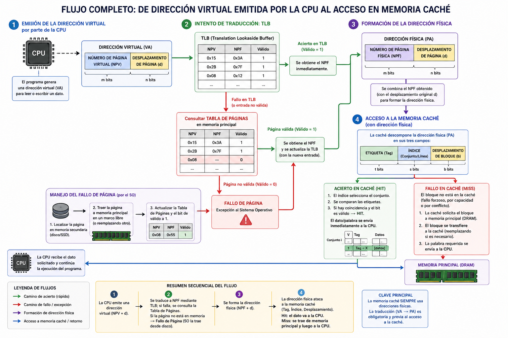

# Ejercicios sobre jerarquía de memoria.

## Supongamos

Un computador con las siguientes características:

- 1. Un procesador de 32 bits.
- 2. Un sistema de memoria virtual con páginas de 4 KB
- 3. Una memoria física de 2 GB
- 4. Una TLB de mapeado directo de 32 entradas
- 5. Una caché unificada asociativa por conjuntos de 4 vías, de 8KB y líneas de 16 bytes.

## Cuestiones

### C1.

- El desplazamiento de página es:
  - 1. 10 bits
  - 2. 12 bits
  - 3. 8 bits
  - 4. 15 bits

### Solución

La opción correcta es la **2. 12 bits**.

Para calcular el desplazamiento de página, el único dato que necesitas de todo el enunciado es el **tamaño de la página**, ya que el desplazamiento sirve exclusivamente para identificar o direccionar cada uno de los bytes individuales que se encuentran dentro de una misma página (tanto física como virtual).

El cálculo es el siguiente:

1. El enunciado indica que el tamaño de página es de 4 KB.
2. Debemos convertir este valor a bytes utilizando potencias base 2:
   $4 \text{ KB} = 4 \times 1024 \text{ bytes} = 2^2 \times 2^{10} \text{ bytes} =$ **$2^{12}$ bytes**.
3. Como hay $2^{12}$ posiciones (bytes) dentro de cada página, necesitamos exactamente **12 bits** para el campo del desplazamiento de página.

Al igual que comentamos en el ejercicio de la Tabla de Páginas, en este tipo de cuestiones es muy común que se incluyan datos trampa o **distractores**. La memoria física de 2 GB, la arquitectura de 32 bits, o la configuración de la TLB y de la memoria caché no intervienen en absoluto a la hora de determinar el desplazamiento de página.

### C2.- El tamaño de la dirección virtual es:

- 1. 32 bits
- 2. 20 bits
- 3. 31 bits
- 4. 28 bits

### Solución

La opción correcta es la **1) 32 bits**.

El tamaño de la dirección virtual viene determinado directamente por la arquitectura del procesador. Dado que el enunciado establece en su primer punto que se trata de un "procesador de 32 bits", las direcciones virtuales que genera la CPU tienen exactamente esa longitud de 32 bits.

### C3.- El tamaño de la dirección física es:

- 1. 32 bits
- 2. 31 bits
- 3. 20 bits
- 4. 19 bits

### Solución

Como la memoria principal es de 2GB (231), la solución correcta es la 2.

### C4.- El número de página virtual es de:

- 1. 32 bits
- 2. 12 bits
- 3. 20 bits
- 4. 19 bits

### Solución

- La solución correcta es la 3: 20 bits.
- Como el desplazamiento de página es de 12 bits, y la dirección virtual es de 32 bits, entonces tenemos 32 -12 = 20.

### C5.- El número de página física (NPF) es de:

- 1. 32 bits
- 2. 12 bits
- 3. 20 bits
- 4. 19 bits

### Solución

- La NPF se calcula a partir del tamaño de la memoria principal: 231 (2GB)
- Para obtener el NPF se le resta el desplazamiento (12bits).
- La solución es 31 - 12 = 19 bits => **opción 4**

### C6.-El número de líneas de la caché es:

- 1. 512
- 2. 256
- 3. 128
- 4. 64

### Solución

- Si las lineas son de 16 bytes (24) y la cache tiene 8KB (213), entonces el número de líneas sera igual a 213-4 => 29 => 512 => la opción correcta es la 1.

### C7.- La dirección física en el acceso a caché se descompone los siguientes campos (el número entre paréntesis indica el número de bits):

- 1. Etiqueta (20), Índice (7), Desplazamiento (4)
- 2. Etiqueta (27), Desplazamiento (4 bits)
- 3. Etiqueta (18) , Índice (9), Desplazamiento (4) -
- 4. Etiqueta (10) , Índice (9), Desplazamiento (12)

### Solución C7

La opción correcta es la **1) Etiqueta (20), Índice (7), Desplazamiento (4)**.

Para llegar a este resultado, debemos utilizar los datos del enunciado general del supuesto que hemos venido usando en las preguntas anteriores (memoria física de 2 GB y una caché asociativa por conjuntos de 4 vías, de 8 KB de capacidad y con líneas de 16 bytes).

El cálculo se realiza paso a paso de la siguiente manera:

**1. Tamaño total de la dirección física:**
Como la memoria principal (física) tiene 2 GB de capacidad, necesitamos calcular cuántos bits hacen falta para direccionar esa cantidad. Sabiendo que $2 \text{ GB} = 2^{31} \text{ bytes}$, el tamaño total de la dirección física será de **31 bits**.

**2. Campo Desplazamiento (Desplazamiento de bloque):**
El desplazamiento sirve para identificar cada byte individual dentro de una línea de caché. El enunciado nos dice que las líneas son de 16 bytes. Como $16 = 2^4$, necesitamos **4 bits** para el desplazamiento.

**3. Campo Índice:**
El índice nos sirve para identificar el conjunto dentro de la caché donde se va a mapear la dirección. Para calcularlo seguimos estos pasos:

- **Total de líneas en la caché:** Dividimos la capacidad total de la caché (8 KB) entre el tamaño de la línea (16 B). $8 \text{ KB} = 2^{13} \text{ bytes}$. Entonces, $2^{13} / 2^4 = 2^9 = 512$ líneas en total.
- **Total de conjuntos:** Como la caché es asociativa por conjuntos de 4 vías, agrupamos esas 512 líneas de 4 en 4. Así, $512 / 4 = 128$ conjuntos. Alternativamente en potencias de 2: $2^9 / 2^2 = 2^7$ conjuntos.
- Como hay $2^7$ conjuntos, necesitamos **7 bits** para el índice.

**4. Campo Etiqueta:**
Finalmente, la etiqueta está formada por los bits restantes de la dirección física una vez extraídos el índice y el desplazamiento.
$$\text{Etiqueta} = \text{Dirección Física} - \text{Índice} - \text{Desplazamiento}$$
$$\text{Etiqueta} = 31 - 7 - 4 = \text{20 bits}$$

Por lo tanto, la descomposición exacta de la dirección física es: **Etiqueta (20), Índice (7) y Desplazamiento (4)**.

### C8.- ¿Cuál es el tamaño de la tabla de página suponiendo que se requieren 3 bits de control?

- 1. 219 x 22 bits
- 2. 220 x 23 bits
- 3. 220 x 22 bits
- 4. 231 x 23 bits

### Solución C8

La opción correcta es la **3. $2^{20} \times 22$ bits**.

Para llegar a este resultado, debemos calcular por separado el número total de entradas de la tabla y el tamaño individual de cada una de esas entradas, usando las características del computador de nuestro supuesto (procesador de 32 bits, páginas de 4 KB y memoria física de 2 GB):

**1. Número de elementos (entradas) de la tabla:**
Como hemos visto anteriormente, la tabla de páginas debe contener una entrada por cada página virtual del espacio de direcciones.
Sabemos que la **dirección virtual total es de 32 bits** y el desplazamiento de página ocupa 12 bits (al ser páginas de 4 KB o $2^{12}$ bytes). Por lo tanto, **el Número de Página Virtual (NPV) es de 20 bits ($32 - 12$)**. Elevando esto a la potencia base 2, deducimos que existen **$2^{20}$ entradas** en la tabla.

**2. Tamaño en bits de cada entrada:**
El objetivo de cada entrada de la tabla es almacenar la traducción física, es decir, el Número de Página Física (NPF), junto con sus respectivos bits de control.

- Para calcular el NPF, tomamos el tamaño de la memoria física que es de 2 GB (lo que requiere direcciones físicas de 31 bits). Al restarle los 12 bits del desplazamiento de página, nos queda un **NPF de 19 bits**.
- El enunciado especifica que debemos sumar **3 bits de control** a cada entrada.
- Por lo tanto, cada entrada de la tabla tiene una longitud exacta de **22 bits** ($19 + 3$).

**Al unir ambos cálculos, obtenemos que la tabla tiene unas dimensiones exactas de `$2^{20}$ entradas multiplicadas por 22 bits por entrada`**.

### C9.- El tamaño de las etiquetas de la TLB es:

- 1. 19 bits
- 2. 20 bits
- 3. 14 bits
- 4. 15 bits

### Solución C9.

- TLB de mapeado directo de 32 entradas => 25
- El tamaño de la etiqueta es de 20 bits => 20 - 5 => 15
- **La opción correcta es la 4**

## Marco teórico

### Número de Página Virtual (NPV).

Vamos a desglosar qué significa cada dato (procesador de 32 bits, páginas de 4 KB y memoria física de 2 GB):

**1. Tamaño de la dirección virtual:**
Viene determinado directamente por la arquitectura del procesador. Como el enunciado indica que es un procesador de 32 bits, **el tamaño total de la dirección virtual es exactamente de 32 bits**.

**2. Número de Página Virtual (NPV):**
La dirección virtual se compone matemáticamente del NPV y del desplazamiento. Si a los 32 bits de la dirección virtual le restas los 12 bits del desplazamiento que calculamos antes, te quedan **20 bits** exclusivamente para el campo del Número de Página Virtual.

Ya que estamos analizando el tamaño de las direcciones, podemos aprovechar para calcular su equivalente en la memoria física:

**3. Tamaño de la dirección física:**
Este tamaño se calcula a partir de la capacidad total de la memoria principal física. Como el computador tiene 2 GB de RAM, esto equivale a $2^{31}$ bytes. Por lo tanto, el tamaño de la dirección física es de **31 bits**.

**4. Número de Página Física (NPF):**
Siguiendo la misma lógica de tu deducción, si a la dirección física total le restamos el desplazamiento de la página (que, recuerda, es exactamente el mismo tanto en la memoria virtual como en la física), obtenemos el NPF: $31 - 12 =$ **19 bits**.

### Flujo completo de acceso a memoria

El proceso que relaciona la emisión de una dirección virtual por parte de la CPU con el acceso a la memoria caché sigue un flujo secuencial muy bien definido. La clave está en que **la memoria caché funciona con direcciones físicas**, por lo que antes de poder buscar el dato en ella, el sistema debe realizar obligatoriamente la **traducción** de la dirección.

El flujo completo paso a paso es el siguiente:

**1. Emisión de la dirección virtual:**
Cuando un programa necesita leer o escribir un dato, la CPU no emite la dirección real de la memoria, sino una dirección virtual. Esta dirección se divide matemáticamente en dos campos: el Número de Página Virtual (NPV) y el Desplazamiento de página.

**2. Intento de traducción mediante la TLB:**
Para obtener la dirección física de forma rápida, el hardware accede primero a la TLB introduciendo exclusivamente el Número de Página Virtual (NPV).

- Si hay un **acierto en la TLB**, se obtiene inmediatamente el Número de Página Física (NPF) correspondiente.
- Si hay un **fallo en la TLB**, el sistema debe consultar la Tabla de Páginas en la memoria principal. Si la página no estuviera cargada (bit de válido a 0), se produciría un **fallo de página** y el Sistema Operativo tendría que traerla desde el disco.

**3. Formación de la dirección física:**
Una vez que el sistema ha conseguido el Número de Página Física (NPF), ya sea a través de la rápida TLB o tras consultar la Tabla de Páginas, une este NPF con el Desplazamiento de página original generado por la CPU (este campo no cambia) para formar la **dirección física completa**.

**4. Acceso a la Memoria Caché:**
¡Aquí es donde entra la caché! Ahora que el sistema tiene la dirección física real, ataca a la memoria caché para intentar buscar el dato. Para ello, la caché descompone esta dirección física recién traducida en tres campos: **Etiqueta, Índice y Desplazamiento de bloque**.

- **Acierto en caché:** Con el índice localiza la línea o conjunto y compara las etiquetas. Si hay coincidencia y el bit es válido, se produce un acierto y el dato se transfiere inmediatamente a la CPU.
- **Fallo en caché:** Si el bloque no está en la caché (ya sea un fallo forzoso, por capacidad o por conflicto), la caché tiene que solicitar el bloque a la memoria principal. Una vez que el bloque es transferido desde la memoria principal a la caché, se envía la palabra requerida a la CPU.

En resumen, existe una fuerte **dependencia secuencial**: la CPU emite la dirección virtual, la jerarquía de memoria virtual (TLB/Tabla de páginas) la traduce a dirección física, y finalmente esta dirección física "ataca" a la jerarquía de memoria caché para recuperar el dato a la máxima velocidad posible.

