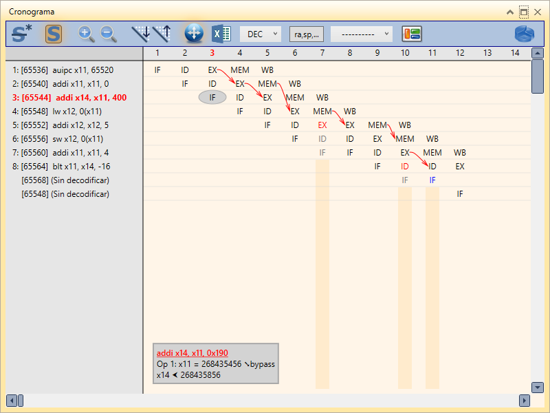

# Ejercicio 4.

## Enunciado

Repita los Ejercicios 1, 2 y 3 suponiendo un RISCV con todos los desvíos activos. Para cada desvío indique de qué registro de segmentación o unidad funcional se toma el dato y a qué registro de segmentación o unidad funcional se lleva.

- ¿Qué conclusiones se obtienen por el hecho de utilizar desvíos?
- ¿Cuántos bloqueos de cada tipo se han eliminado?

Finalmente, compruebe utilizando el simulador RISCV (con Adelantamientos activado) que los resultados obtenidos son correctos.

## Solución

### Código

```asm
la a1, x # x base address
addi a4, a1, 400 # x address loop end

bucle:
    lw a2, 0(a1) # x[i]
    addi a2, a2, 5 # x[i] + 5
    sw a2, 0(a1) # store back
    addi a1, a1, 4 # i++
    blt a1, a4, bucle # loop i<100

li a7 , 10 # Syscall exit
ecall
```

### Cronograma sin desvios ejercicio 1 - Primera iteración

|     | Ciclo                     | 1   | 2   | 3      | 4      | 5    | 6      | 7      | 8    | 9   | 10     | 11     | 12   | 13     | 14     | 15   | 16  | 17     | 18     | 19   | 20      |
| :-- | :------------------------ | :-- | :-- | :----- | :----- | :--- | :----- | :----- | :--- | :-- | :----- | :----- | :--- | :----- | :----- | :--- | :-- | :----- | :----- | :--- | :------ |
| 1   | `auipc a1, 0xfff0`        | IF  | ID  | EX     | MEM    | _WB_ |        |        |      |     |        |        |      |        |        |      |     |        |        |      |         |
| 2   | `addi a1, a1, 0`          |     | IF  | **ID** | **ID** | _ID_ | EX     | MEM    | _WB_ |     |        |        |      |        |        |      |     |        |        |      |         |
| 3   | `addi a4, x11, 400`       |     |     | IF     | IF     | IF   | **ID** | **ID** | _ID_ |     |        |        |      |        |        |      |     |        |        |      |         |
| 4   | `lw a2, 0(a1)`            |     |     |        |        |      |        |        | IF   | ID  | EX     | MEM    | _WB_ |        |        |      |     |        |        |      |         |
| 5   | `addi a2, a2, 5`          |     |     |        |        |      |        |        |      | IF  | **ID** | **ID** | _ID_ | EX     | MEM    | _WB_ |     |        |        |      |         |
| 6   | `sw a2, 0(a1)`            |     |     |        |        |      |        |        |      |     | **IF** | **IF** | _IF_ | **ID** | **ID** | _ID_ | EX  | MEM    |        |      |         |
| 7   | `addi a1, a1, 4`          |     |     |        |        |      |        |        |      |     |        |        |      | **IF** | **IF** | _IF_ | ID  | EX     | MEM    | _WB_ |         |
| 8   | `blt a1, a4, bucle`       |     |     |        |        |      |        |        |      |     |        |        |      |        |        |      | IF  | **ID** | **ID** | _ID_ | EX      |
| 9   | `addi a7, x0, 10`         |     |     |        |        |      |        |        |      |     |        |        |      |        |        |      |     | **IF** | **IF** | _IF_ | _flush_ |
| 10  | `lw a2, 0(a1)` (2ª iter.) |     |     |        |        |      |        |        |      |     |        |        |      |        |        |      |     |        |        |      | IF      |

### Repetimos ejercicio 1 con desvios activos - Primera iteración

|     | Ciclo                     | 1   | 2   | 3              | 4                         | 5               | 6             | 7               | 8             | 9               | 10             | 11            | 12      | 13  | 14  |
| :-- | :------------------------ | :-- | :-- | :------------- | :------------------------ | :-------------- | :------------ | :-------------- | :------------ | :-------------- | :------------- | :------------ | :------ | :-- | :-- | --- |
| 1   | `auipc a1, 0xfff0`        | IF  | ID  | EX `out_1(a1)` | MEM                       | WB              |               |                 |               |                 |                |               |         |     |     |
| 2   | `addi a1, a1, 0`          |     | IF  | ID             | EX `in_1(a1)` `out_2(a1)` | MEM `out_3(a1)` | WB            |                 |               |                 |                |               |         |     |     |
| 3   | `addi a4, a1, 400`        |     |     | IF             | ID                        | EX `in_2(a1)`   | MEM           | WB              |               |                 |                |               |         |     |     |
| 4   | `lw a2, 0(a1)`            |     |     |                | IF                        | ID              | EX `in_3(a1)` | MEM `out_4(a2)` | WB            |                 |                |               |         |     |     |
| 5   | `addi a2, a2, 5`          |     |     |                |                           | IF              | **ID**        | ID              | EX `in_4(a2)` | MEM `out_5(a2)` | WB             |               |         |     |     |     |
| 6   | `sw a2, 0(a1)`            |     |     |                |                           |                 |               | IF              | ID            | EX              | MEM `in_5(a2)` |               |         |     |
| 7   | `addi a1, a1, 4`          |     |     |                |                           |                 |               |                 | IF            | ID              | EX `out_6(a1)` | MEM           | WB      |     |
| 8   | `blt a1, a4, bucle`       |     |     |                |                           |                 |               |                 |               | IF              | **ID**         | ID `in_6(a1)` | EX      | MEM | WB  |
| 9   | `addi a7, x0, 10`         |     |     |                |                           |                 |               |                 |               |                 | IF             | IF            | _flush_ |     |     |
| 10  | `lw a2, 0(a1)` (2ª iter.) |     |     |                |                           |                 |               |                 |               |                 |                |               | IF      |     |

_Simulacion primera iteracion con devios_


