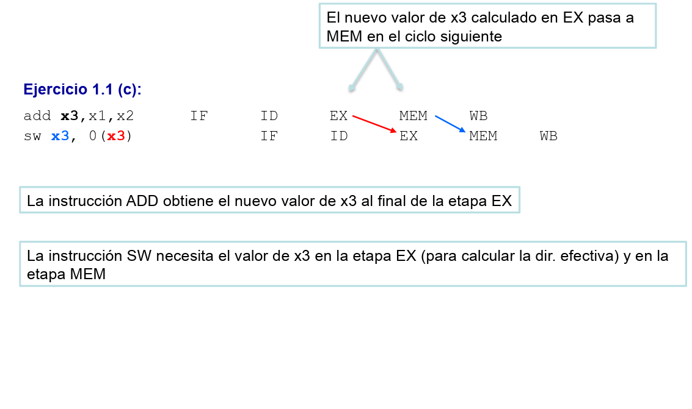

# Bloque de datos instrucción sw

## Pregunta

En este código, con desvíos activos

```esm
add x3,x1,x2
sw x3, 0(x3)
```

sw necesita el valor de x3 en dos momentos distintos, pero es el mismo dato, una vez la instrucción sw "lo tiene" en su etapa EX por un bypass EX -> EX, por qué necesita que se le vuelva a pasar de nuevo en la etapa MEM (bypass MEM ->MEM)?

## Respuesta

La respuesta corta es: **se debe a una limitación física en el diseño del hardware (el camino de datos) de la etapa EX**.

Para entenderlo, hay que analizar qué ruta física sigue cada operando dentro del procesador. En la instrucción `sw x3, 0(x3)`, el registro `x3` cumple **dos funciones completamente distintas** de forma simultánea:

1. Actúa como **registro base (`rs1`)** para calcular la dirección de memoria (`x3 + 0`).
2. Actúa como **dato a almacenar (`rs2`)** en dicha dirección.

Aquí es donde entra en juego la circuitería del "diagrama original" del RISC-V segmentado que estudias en la asignatura:

- **El cálculo de la dirección (`rs1`) SÍ pasa por la ALU:** Como la etapa EX tiene multiplexores de anticipación (bypasses) controlados por la _Forwarding unit_ justo a la entrada de la ALU, la instrucción `sw` consigue capturar perfectamente el nuevo valor de `x3` (mediante el desvío EX/MEM -> ALU) para calcular la dirección correcta.
- **El dato a almacenar (`rs2`) NO pasa por la ALU:** En el diseño estándar del pipeline, el cable que lleva el dato a almacenar viaja en paralelo a la ALU y va **directamente** al registro de segmentación `EX/MEM`. Es decir, el canal de los datos a almacenar **esquiva y queda fuera de los multiplexores de anticipación de la etapa EX**.

**¿Qué consecuencia tiene esto?**
Aunque la unidad de anticipación le da el dato correcto a la ALU en la etapa EX para la dirección, es físicamente incapaz de inyectárselo al canal del "dato a almacenar". Por tanto, lo que viaja y se guarda en el registro de segmentación `EX/MEM` para ser escrito en memoria es el **valor obsoleto** de `x3` (el que se leyó erróneamente en la etapa ID).

**La solución: El nuevo desvío a la etapa MEM**
Como la etapa EX fue incapaz de actualizar la rama del dato a almacenar, el hardware no tiene más remedio que corregir el valor en la siguiente etapa, justo en el último milisegundo antes de meterlo en la memoria.

**En resumen:** la instrucción "tiene" el dato en la etapa EX únicamente para **operar** con él (calcular la dirección), pero como el hardware original no dispone de multiplexores para guardar ese dato adelantado en el canal de almacenamiento, necesita que se le vuelva a inyectar directamente en la etapa MEM para poder **escribirlo** físicamente.


